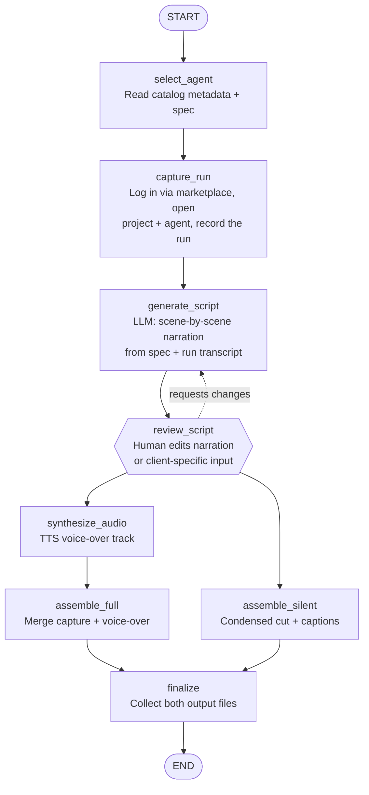

# Demo Video Generator Agent

## Table of Contents

1. [Project Overview](#1-project-overview)
2. [ADLC Phase 1 — Planning](#2-adlc-phase-1--planning)
3. [ADLC Phase 2 — Design](#3-adlc-phase-2--design)
4. [ADLC Phase 3 — Development](#4-adlc-phase-3--development)
5. [ADLC Phase 4 — Testing](#5-adlc-phase-4--testing)
6. [ADLC Phase 5 — Deployment](#6-adlc-phase-5--deployment)
7. [Risks & Mitigations](#7-risks--mitigations)
8. [References](#8-references)

---

## 1. Project Overview

**DemoVideoBot** automatically produces demo videos for agents running on the
AgenticQEAHub platform. For each target agent it generates two outputs: a
narrated walkthrough and a shorter, silent condensed cut.

This is a standalone service. AgenticQEAHub is treated as an external system —
DemoVideoBot connects to its UI and APIs over the network and reads its agent
docs; none of the platform's code lives in this repository.

### Problem Statement

Producing a demo video by hand means running the agent, recording the screen,
writing narration, recording voice-over, and editing two separate cuts. It takes
hours per agent and has to be repeated every time an agent changes or a new one
is added.

### Why Automation

| Problem | Impact |
|---------|--------|
| Manual screen recording per agent | ~2–3 hrs per agent |
| Hand-written narration + voice-over | Inconsistent tone across agents |
| Two cuts edited separately | Doubles editing time |
| Re-do on every agent change | Videos go stale quickly |

### Expected Outcomes

| Metric | Target |
|--------|--------|
| Time to produce both videos | < 15 min, unattended |
| Manual editing steps | 0 |
| Coverage | All agents in the platform catalog |
| Refresh on agent update | On demand / scheduled |

---

## 2. ADLC Phase 1 — Planning

### Goals

1. Read a target agent's spec and metadata from AgenticQEAHub
2. Capture a real run of the agent as screen video
3. Generate a scene-by-scene narration script from the spec + run
4. Let a person review and edit the script (or client-specific input) before rendering
5. Synthesize a voice-over track from the script
6. Assemble a narrated walkthrough video
7. Assemble a shorter, silent condensed cut with on-screen captions

### Scope

**In Scope**
- Agent discovery, run capture, script generation, TTS narration, video
  assembly of both a narrated and a silent version.

**Out of Scope**
- Editing the platform itself, thumbnails/intro branding, publishing to a
  hosting site, multi-language narration (v1).

### Tools & Integrations

| Tool | Purpose |
|------|---------|
| AgenticQEAHub (external) | Agent catalog, docs, run event stream, run API |
| Playwright | Log into the platform, drive the UI, record the run video |
| Google Gemini | Generate the narration script |
| Google Gemini TTS | Voice-over audio (same API key as script generation) |
| FFmpeg | Merge video + audio, produce the condensed cut |

> **Note:** script generation currently runs on a personal Gemini API key for
> prototyping. Before rollout this should move to an org-issued key stored in
> a secrets manager, same as the platform login credentials below.

### LLM Rationale

Gemini is being used for its large context window (fits a full agent spec
plus a complete run transcript in one pass) and structured JSON output for
the scene list.

---

## 3. ADLC Phase 2 — Design

### Pipeline Flow



### State Schema

```python
class VideoState(TypedDict):
    # Input
    agent_id: str            # e.g. "defect-triaging-crewai"
    project_id: str

    # From platform
    agent_name: str
    agent_spec: str          # markdown doc for the agent
    run_id: str
    run_transcript: list[dict]   # structured step/HITL events from the run

    # Capture
    raw_video_path: str      # full screen recording of the run

    # Script
    scenes: list[dict]       # [{start, end, on_screen, narration}]
    custom_instructions: str # optional per-client asks (naming, tone, focus areas)
    script_status: str       # "pending_review" | "approved"

    # Audio
    narration_audio_path: str

    # Outputs
    narrated_video_path: str
    silent_video_path: str
    status: str
```

### Stage Summary

| Stage | Responsibility | LLM? |
|-------|----------------|------|
| `select_agent` | Fetch agent metadata + spec doc from the platform | No |
| `capture_run` | Log into the platform, open the target project + agent, trigger a run, and record video | No |
| `generate_script` | Build timed scene list with narration from spec + run | Yes |
| `review_script` | Pause for human edit of script / client-specific input; resumes on approval | No |
| `synthesize_audio` | Render narration lines into a voice track | No |
| `assemble_full` | Merge recording with voice-over into the narrated video | No |
| `assemble_silent` | Produce a shorter cut with captions instead of voice | No |
| `finalize` | Validate and collect both output files | No |

---

## 4. ADLC Phase 3 — Development

### Tech Stack

| Layer | Technology |
|-------|-----------|
| Language | Python 3.11+ |
| Orchestration | LangGraph 1.0+ |
| Browser capture | Playwright (video recording enabled) |
| LLM | Google Gemini (script generation) |
| TTS | Google Gemini TTS (same API key) |
| Media assembly | FFmpeg |
| API server | FastAPI |

### Project Structure

```
demo-video-agent/
├── app/
│   ├── agent/
│   │   ├── graph.py          # StateGraph definition
│   │   ├── state.py          # VideoState schema
│   │   └── nodes/
│   │       ├── select_agent.py
│   │       ├── capture_run.py
│   │       ├── generate_script.py
│   │       ├── synthesize_audio.py
│   │       ├── assemble_full.py
│   │       ├── assemble_silent.py
│   │       └── finalize.py
│   ├── clients/
│   │   ├── hub_client.py      # AgenticQEAHub catalog / docs / run API
│   │   └── tts_client.py
│   └── api/
│       └── routes.py
├── output/                    # generated videos land here
├── tests/
├── .env.example
├── Dockerfile
└── docker-compose.yml
```

### Sample Node — `capture_run`

This is the step that mirrors what you do manually today: log in, open the
project and agent, run it, and record the screen. Credentials are read from
environment variables — never hardcoded.

```python
def capture_run(state: VideoState) -> dict:
    with sync_playwright() as p:
        browser = p.chromium.launch()
        context = browser.new_context(
            record_video_dir="output/raw",
            record_video_size={"width": 1920, "height": 1080},
        )
        page = context.new_page()

        page.goto(f"{HUB_BASE_URL}/marketplace")
        page.fill("#email", os.environ["HUB_EMAIL"])
        page.fill("#password", os.environ["HUB_PASSWORD"])
        page.click("#login")

        page.goto(f"{HUB_BASE_URL}/workspace"
                  f"?agent={state['agent_id']}&project={state['project_id']}")
        transcript = run_agent_and_collect_events(page, state["agent_id"])

        context.close()   # finalizes the video file
        browser.close()

    return {
        "raw_video_path": latest_video_in("output/raw"),
        "run_transcript": transcript,
        "status": "captured",
    }
```

The remaining stages (`generate_script`, `review_script`, `synthesize_audio`,
`assemble_full`, `assemble_silent`) follow the same pattern described in the
Stage Summary above — each takes the previous stage's output and hands off
a plain dict to the next one.

---

## 5. ADLC Phase 4 — Testing

### Strategy

| Level | Tool | Focus |
|-------|------|-------|
| Unit | pytest + mock | Each node in isolation (mock hub + TTS) |
| Integration | pytest (live) | Full graph against one real agent |
| Output check | FFprobe assertions | Resolution, duration, audio track present |

### Sample Test Scenarios

| Scenario | Expected Result |
|----------|-----------------|
| Known agent, successful run | Two files produced; narrated has audio, silent is muted |
| Client requests custom wording before rendering | Script paused for edit; final video reflects the edited lines |
| Agent with a HITL prompt in the run | Prompt appears in capture and is described in narration |
| TTS service unavailable | Silent cut still produced; job flagged for audio retry |
| Capture times out | Retried once, then errors cleanly with a log |
| New agent added to catalog | Picked up and processed without code changes |

### Evaluation Metrics

| Metric | Target |
|--------|--------|
| Output resolution | 1920×1080 |
| Narrated cut length | Full walkthrough (~5–8 min) |
| Silent cut length | Condensed (~1–2 min) |
| End-to-end success rate | ≥ 90% of catalog agents |
| Total runtime per agent | < 15 min |

---

## 6. ADLC Phase 5 — Deployment

### Deployment Options

| Option | How |
|--------|-----|
| Local | `uvicorn app.api.routes:app --reload` |
| Docker | `docker build + docker run --env-file .env` |
| Docker Compose | `docker compose up -d` (agent + Playwright browsers) |

### Key Environment Variables

```env
GEMINI_API_KEY=...            # covers both script generation and TTS voice-over
AGENTICQEAHUB_BASE_URL=https://<platform-host>
HUB_EMAIL=...                 # service/shared login, not a personal account
HUB_PASSWORD=...              # stored in a secrets manager, never in code
OUTPUT_DIR=./output
```

> Login credentials and API keys are only ever read from the environment /
> secrets manager at runtime — they're never written into code, config
> checked into the repo, or documentation.

### Monitoring

| Tool | Purpose |
|------|---------|
| LangSmith | LLM traces for script generation |
| structlog | Structured JSON logs per stage |
| Sentry | Unhandled exceptions (capture / assembly failures) |

---

## 7. Risks & Mitigations

| Risk | Mitigation |
|------|-----------|
| Platform UI changes break capture | Centralize selectors; version-pin against UI releases |
| Run is slow or hangs during capture | Per-stage timeout + one retry, then fail cleanly |
| TTS narration sounds unnatural | Configurable voice; review pass before first rollout |
| Condensed cut trims the wrong parts | Drive trimming from scene timing in the script, not fixed rules |
| Access to the live platform unavailable | Support the platform's mock-run mode for repeatable capture |
| Large raw recordings fill disk | Compress and clean up raw captures after assembly |
| Review step delays turnaround | Auto-approve after a timeout, or offer a "skip review" flag for standard runs |
| Using a personal API key / personal login for now | Fine for prototyping; move to an org-managed Gemini key and a shared service login before wider rollout |

---

## 8. References

- [LangGraph Documentation](https://langchain-ai.github.io/langgraph/)
- [LangGraph StateGraph API](https://langchain-ai.github.io/langgraph/reference/graphs/)
- [Playwright — Videos](https://playwright.dev/python/docs/videos)
- [FFmpeg Documentation](https://ffmpeg.org/documentation.html)
- [LangSmith Tracing](https://docs.smith.langchain.com/)
