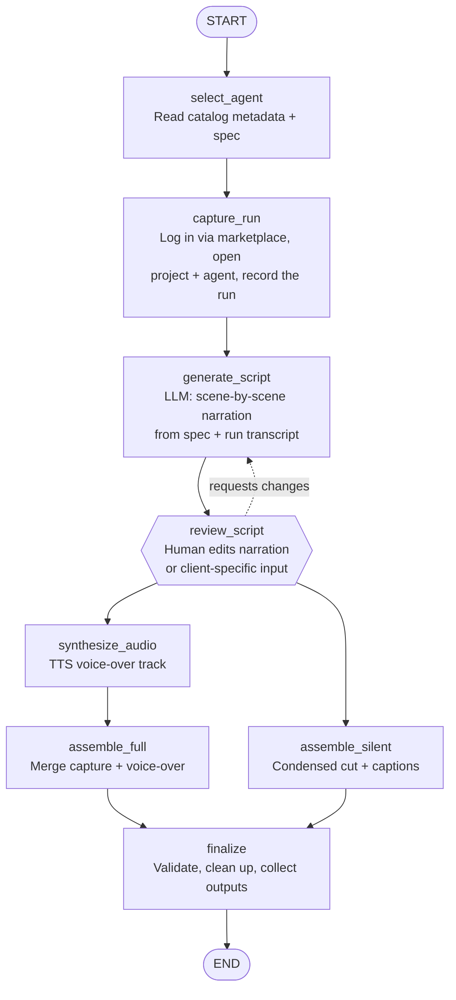

# Demo Video Generator Agent

## Table of Contents

1. [Project Overview](#1-project-overview)
2. [ADLC Phase 1 — Planning](#2-adlc-phase-1--planning)
3. [ADLC Phase 2 — Design](#3-adlc-phase-2--design)
4. [ADLC Phase 3 — Development](#4-adlc-phase-3--development)
5. [ADLC Phase 4 — Testing](#5-adlc-phase-4--testing)
6. [ADLC Phase 5 — Deployment](#6-adlc-phase-5--deployment)
7. [Risks & Mitigations](#7-risks--mitigations)
8. [References](#8-references)

---

## 1. Project Overview

**DemoVideoBot** automatically produces demo videos for agents running on the
AgenticQEAHub platform. For each target agent it generates two outputs: a
narrated walkthrough and a shorter, silent condensed cut.

A React web UI lets users submit a job, review and edit the AI-generated
narration script, and view the finished output file paths — no command-line
interaction required for day-to-day use.

This is a standalone service. AgenticQEAHub is treated as an external system —
DemoVideoBot connects to its UI and APIs over the network and reads its agent
docs; none of the platform's code lives in this repository.

### Problem Statement

Producing a demo video by hand means running the agent, recording the screen,
writing narration, recording voice-over, and editing two separate cuts. It takes
hours per agent and has to be repeated every time an agent changes or a new one
is added.

### Why Automation

| Problem | Impact |
|---------|--------|
| Manual screen recording per agent | ~2–3 hrs per agent |
| Hand-written narration + voice-over | Inconsistent tone across agents |
| Two cuts edited separately | Doubles editing time |
| Re-do on every agent change | Videos go stale quickly |

### Expected Outcomes

| Metric | Target |
|--------|--------|
| Time to produce both videos | < 15 min, unattended |
| Manual editing steps | 0 (optional script review only) |
| Coverage | All agents in the platform catalog |
| Refresh on agent update | On demand / scheduled |

---

## 2. ADLC Phase 1 — Planning

### Goals

1. Read a target agent's spec and metadata from AgenticQEAHub
2. Capture a real run of the agent as screen video
3. Generate a scene-by-scene narration script from the spec + run
4. Let a person review and edit the script (or client-specific input) before rendering
5. Synthesize a voice-over track from the script
6. Assemble a narrated walkthrough video
7. Assemble a shorter, silent condensed cut with on-screen captions

### Scope

**In Scope**
- Agent discovery, run capture, script generation, TTS narration, video
  assembly of both a narrated and a silent version, and a web UI for the review step.

**Out of Scope**
- Editing the platform itself, thumbnails/intro branding, publishing to a
  hosting site, multi-language narration (v1).

### Tools & Integrations

| Tool | Purpose |
|------|---------|
| AgenticQEAHub (external) | Agent catalog, docs, run event stream, run API |
| Playwright | Log into the platform, drive the UI, record the run video |
| Google Gemini | Generate the narration script |
| Google Gemini TTS | Voice-over audio (same API key as script generation) |
| FFmpeg | Merge video + audio, produce the condensed cut |
| React + Vite | Web UI for job submission, script review, and results |

> **Note:** script generation currently runs on a personal Gemini API key for
> prototyping. Before rollout this should move to an org-issued key stored in
> a secrets manager, same as the platform login credentials below.

### LLM Rationale

Gemini is being used for its large context window (fits a full agent spec
plus a complete run transcript in one pass) and structured JSON output for
the scene list.

---

## 3. ADLC Phase 2 — Design

### Pipeline Flow



### State Schema

```python
class VideoState(TypedDict):
    # Input
    agent_name: str          # display name, e.g. "Defect Triage (CrewAI)"
    project_name: str        # display name, e.g. "Dev test project"

    # From platform
    agent_display_name: str  # canonical name as shown in the platform
    agent_spec: str          # markdown doc for the agent
    run_id: str
    run_transcript: list[dict]   # structured step/HITL events from the run

    # Capture
    raw_video_path: str      # full screen recording of the run

    # Script
    scenes: list[dict]       # [{start, end, on_screen, narration}]
    custom_instructions: str # optional per-client asks (naming, tone, focus areas)
    script_status: str       # "pending_review" | "approved"

    # Audio
    narration_audio_path: str

    # Outputs
    narrated_video_path: str
    silent_video_path: str
    status: str
```

### Stage Summary

| Stage | Responsibility | LLM? |
|-------|----------------|------|
| `select_agent` | Fetch agent metadata + spec doc from the platform | No |
| `capture_run` | Log into the platform, open the target project + agent, trigger a run, and record video | No |
| `generate_script` | Build timed scene list with narration from spec + run | Yes (Gemini) |
| `review_script` | Pause for human edit of script / client-specific input; resumes on approval | No |
| `synthesize_audio` | Render narration lines into a voice track | No (Gemini TTS) |
| `assemble_full` | Merge recording with voice-over into the narrated video | No |
| `assemble_silent` | Produce a shorter cut with captions instead of voice | No |
| `finalize` | Validate both outputs with ffprobe, clean up intermediates | No |

### API Design

| Endpoint | Method | Purpose |
|----------|--------|---------|
| `/videos` | POST | Start pipeline; returns `thread_id` immediately |
| `/videos/{thread_id}/status` | GET | Poll for job status (`running` / `awaiting_review` / `done` / `error`) |
| `/videos/{thread_id}/resume` | POST | Resume after review (`action: approve` or `edit`) |
| `/health` | GET | Liveness check |

---

## 4. ADLC Phase 3 — Development

### Tech Stack

| Layer | Technology |
|-------|-----------|
| Language | Python 3.11+ |
| Orchestration | LangGraph 0.2+ |
| Browser capture | Playwright (video recording enabled) |
| LLM | Google Gemini (`gemini-2.0-flash`) |
| TTS | Google Gemini TTS (`gemini-2.0-flash-preview-tts`) |
| Media assembly | FFmpeg |
| API server | FastAPI (non-blocking — pipeline runs in background threads) |
| Frontend | React 18 + Vite 5 |

### Project Structure

```
demo-video-agent/
├── backend/                      # all Python / server-side code
│   ├── agents/                   # per-agent HITL prompt configs (one file per agent)
│   │   ├── __init__.py           # registry: maps display names → config modules
│   │   └── defect_triage_crewai.py  # HITL prompts + responses for Defect Triage (CrewAI)
│   ├── app/
│   │   ├── agent/
│   │   │   ├── graph.py          # StateGraph definition + checkpointer wiring
│   │   │   ├── state.py          # VideoState schema
│   │   │   └── nodes/
│   │   │       ├── select_agent.py
│   │   │       ├── capture_run.py
│   │   │       ├── generate_script.py
│   │   │       ├── review_script.py
│   │   │       ├── synthesize_audio.py
│   │   │       ├── assemble_full.py
│   │   │       ├── assemble_silent.py
│   │   │       └── finalize.py
│   │   ├── clients/
│   │   │   ├── hub_client.py     # AgenticQEAHub — all UI selectors live here
│   │   │   └── tts_client.py     # Gemini TTS wrapper
│   │   ├── api/
│   │   │   └── routes.py         # FastAPI routes + background thread job store
│   │   └── config.py             # All env vars loaded here; fails loudly if missing
│   ├── tests/
│   │   ├── conftest.py
│   │   ├── test_generate_script.py
│   │   ├── test_synthesize_audio.py
│   │   ├── test_assemble.py
│   │   ├── test_finalize.py
│   │   └── test_routes.py
│   └── scripts/                  # dev/QA utilities (screenshots, selector mapping)
├── frontend/                     # React web UI
│   ├── src/
│   │   ├── App.jsx               # State machine + polling logic
│   │   ├── App.css               # Light-mode styles with Cognizant brand accent
│   │   ├── api.js                # fetch wrappers for all three API calls
│   │   └── components/
│   │       ├── PipelineForm.jsx  # Project Name / Agent Name / instructions form
│   │       ├── ProgressView.jsx  # Spinner + step list while pipeline runs
│   │       ├── SceneReviewer.jsx # Editable scene cards with Approve / Edit actions
│   │       └── ResultsView.jsx   # Output file paths + Generate Another
│   ├── vite.config.js            # Proxies /videos + /health to :8000 in dev
│   └── package.json
├── docs/                         # full documentation
├── output/                       # generated videos land here
├── requirements.txt              # Python dependencies (installed from repo root)
├── .env.example
├── Dockerfile                    # multi-stage: Node build + Python runtime
└── docker-compose.yml
```

### Sample Node — `capture_run`

This is the step that mirrors what you do manually today: log in, navigate to
the project and agent by their display names, run it, handle any HITL prompts
automatically, and record the screen. Credentials are read from environment
variables — never hardcoded. HITL responses are loaded from `agents/`.

```python
def capture_run(state: VideoState) -> dict:
    agent_name   = state["agent_name"]
    project_name = state["project_name"]

    agent_cfg      = get_agent_config(agent_name)
    hitl_responses = getattr(agent_cfg, "HITL_RESPONSES", []) if agent_cfg else []

    raw_dir = Path(config.OUTPUT_DIR) / "raw"
    raw_dir.mkdir(parents=True, exist_ok=True)

    with sync_playwright() as p:
        browser = p.chromium.launch(headless=True)
        context = browser.new_context(
            record_video_dir=str(raw_dir),
            record_video_size={"width": 1920, "height": 1080},
        )
        page = context.new_page()
        hub_client.login(page)
        transcript = hub_client.run_agent_and_collect_events(
            page,
            project_name=project_name,
            agent_name=agent_name,
            hitl_responses=hitl_responses,
        )
        context.close()   # finalizes the video file
        browser.close()

    return {
        "raw_video_path": _latest_video_in(raw_dir),
        "run_transcript": transcript,
        "status": "captured",
    }
```

---

## 5. ADLC Phase 4 — Testing

### Strategy

| Level | Tool | Focus |
|-------|------|-------|
| Unit | pytest + mock | Each node in isolation (mock hub, TTS, ffprobe) |
| Integration | pytest (live) | Full graph against one real agent |
| Output check | ffprobe assertions | Resolution, duration, audio track present/absent |

### Test Coverage (41 tests — all passing)

| File | Tests | What's covered |
|------|-------|----------------|
| `test_generate_script.py` | 12 | JSON parsing, field validation, ordering, overlap detection |
| `test_synthesize_audio.py` | 4 | WAV concatenation correctness and format preservation |
| `test_assemble.py` | 11 | Caption escaping, FFmpeg filter-complex string construction |
| `test_finalize.py` | 9 | ffprobe mock validation (narrated + silent stream checks) |
| `test_routes.py` | 6 | Health, job creation, status polling, resume 404/400 cases |
| `test_placeholder.py` | 1 | Graph builds without error |

### Sample Test Scenarios

| Scenario | Expected Result |
|----------|-----------------|
| Known agent, successful run | Two files produced; narrated has audio, silent is muted |
| Client requests custom wording before rendering | Script paused for edit in UI; final video reflects the edited lines |
| Agent with a HITL prompt in the run | Prompt appears in capture and is described in narration |
| Capture times out | Retried once (RetryPolicy), then errors cleanly with a structlog entry |
| New agent added to catalog | Picked up and processed without code changes |

### Evaluation Metrics

| Metric | Target |
|--------|--------|
| Output resolution | 1920×1080 |
| Narrated cut length | Full walkthrough (~5–8 min) |
| Silent cut length | Condensed (~1–2 min) |
| End-to-end success rate | ≥ 90% of catalog agents |
| Total runtime per agent | < 15 min |

---

## 6. ADLC Phase 5 — Deployment

### Deployment Options

| Option | How |
|--------|-----|
| Local (dev) | Two terminals: `cd backend && uvicorn app.api.routes:app --reload` + `cd frontend && npm run dev` — see `docs/INSTALL.md` |
| Production (single process) | `npm run build` in `frontend/`, then `uvicorn` — FastAPI serves the React build |
| Docker | `docker build -t demo-video-bot . && docker run --env-file .env -p 8000:8000 demo-video-bot` |
| Docker Compose | `docker compose up -d` |

### Key Environment Variables

```env
GEMINI_API_KEY=...            # covers both script generation and TTS voice-over
AGENTICQEAHUB_BASE_URL=https://<platform-host>
HUB_EMAIL=...                 # service/shared login, not a personal account
HUB_PASSWORD=...              # stored in a secrets manager, never in code
OUTPUT_DIR=./output
SKIP_REVIEW=false             # set true to auto-approve scripts (batch runs)
```

> Login credentials and API keys are only ever read from the environment /
> secrets manager at runtime — they're never written into code, config
> checked into the repo, or documentation.

### Monitoring

| Tool | Purpose |
|------|---------|
| structlog | Structured JSON logs per stage (capture_run, generate_script, finalize) |
| LangSmith | LLM traces for script generation |
| Sentry | Unhandled exceptions (capture / assembly failures) |

---

## 7. Risks & Mitigations

| Risk | Mitigation |
|------|-----------|
| Platform UI changes break capture | Centralize selectors in `hub_client.py`; version-pin against UI releases |
| Run is slow or hangs during capture | Playwright 5-min timeout + `RetryPolicy(max_attempts=2)` in graph |
| TTS narration sounds unnatural | Configurable voice in `tts_client.py`; review pass before first rollout |
| Condensed cut trims the wrong parts | Drive trimming from scene timing in the script, not fixed rules |
| Access to the live platform unavailable | Support the platform's mock-run mode for repeatable capture |
| Large raw recordings fill disk | `finalize._cleanup` removes raw + audio intermediates after assembly |
| Review step delays turnaround | `SKIP_REVIEW=true` auto-approves; UI review takes < 5 min |
| Using a personal API key for now | Fine for prototyping; move to an org-managed Gemini key before wider rollout (one-line change in `config.py`) |
| In-memory job store lost on restart | Acceptable for prototype; swap `MemorySaver` for `SqliteSaver` before multi-worker deploy |

---

## 8. References

- [LangGraph Documentation](https://langchain-ai.github.io/langgraph/)
- [LangGraph StateGraph API](https://langchain-ai.github.io/langgraph/reference/graphs/)
- [Playwright — Videos](https://playwright.dev/python/docs/videos)
- [FFmpeg Documentation](https://ffmpeg.org/documentation.html)
- [Google Gemini API](https://ai.google.dev/gemini-api/docs)
- [Vite Documentation](https://vitejs.dev/)
