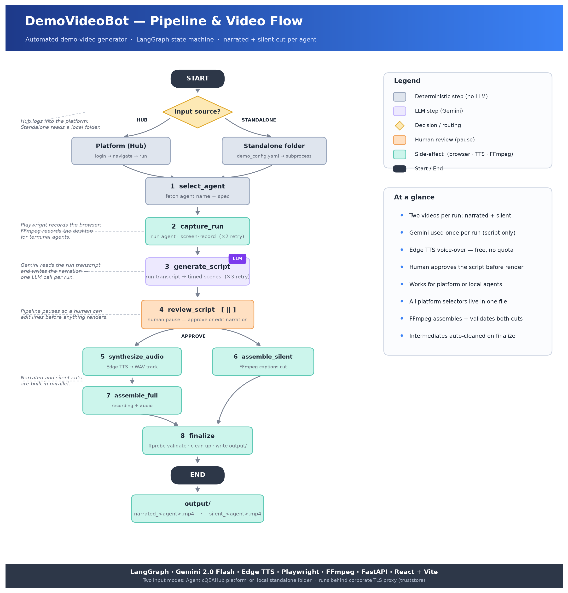

# DemoVideoBot — Architecture

## System Diagram



> The Mermaid source for the diagram is below. The PNG above is generated by
> `scripts/generate_architecture_png.py`.

```mermaid
flowchart TD
    User([User]) --> UI

    subgraph Frontend ["React Web UI  ·  localhost:5173"]
        UI[PipelineForm\nSource toggle + fields]
        PV[ProgressView\nPolls every 5 s]
        SR[SceneReviewer\nEdit narration lines]
        RV[ResultsView\nFile paths]
    end

    UI  -->|POST /videos|            API
    PV  -->|GET /videos/id/status|   API
    SR  -->|POST /videos/id/resume|  API

    subgraph Backend ["FastAPI Backend  ·  localhost:8000"]
        API[routes.py\nBackground thread per job]
        MEM[MemorySaver\nIn-memory job store]
        API --- MEM
    end

    API --> PL

    subgraph PL ["LangGraph Pipeline"]
        direction TB
        S1[1  select_agent]   --> S2
        S2[2  capture_run\nretry x2]    --> S3
        S3[3  generate_script\nretry x3] --> S4
        S4[4  review_script\n⏸ human pause] --> S5 & S6
        S5[5  synthesize_audio] --> S7
        S6[6  assemble_silent]  --> S8
        S7[7  assemble_full]    --> S8
        S8[8  finalize\nvalidate + clean up]
    end

    subgraph Sources ["Input Sources"]
        HUB["Platform Hub\nAgenticQEAHub\n(Playwright browser)"]
        STA["Standalone Folder\ndemo_config.yaml\n(subprocess / Playwright)"]
    end

    S1 & S2 -->|source_type = hub|        HUB
    S1 & S2 -->|source_type = standalone| STA

    subgraph Services ["External / Local Services"]
        GEM["Gemini API\nScript generation\n(1 call / run)"]
        TTS["Edge TTS\nVoice-over\n(free, local)"]
        FFM["FFmpeg\nVideo + audio assembly\n(local)"]
    end

    S3 --> GEM
    S5 --> TTS
    S7 & S6 --> FFM

    S8 -->|writes| OUT["output/\nnarrated_*.mp4\nsilent_*.mp4"]
```

---

## Component Breakdown

### Frontend — React + Vite

| Component | Purpose |
|-----------|---------|
| `PipelineForm` | Collects input: source type toggle (Hub / Standalone), agent details or folder path, optional custom instructions |
| `ProgressView` | Spinner + step hints; polls `GET /status` every 5 s while the pipeline runs |
| `SceneReviewer` | Editable scene cards (on-screen caption + narration text); sticky Approve / Edit bar |
| `ResultsView` | Shows output file paths after the pipeline completes |

In development the Vite dev server proxies `/videos` and `/health` to the backend, so no CORS configuration is needed. In production FastAPI serves the built React bundle via `StaticFiles`.

---

### Backend — FastAPI

`app/api/routes.py` exposes three REST endpoints:

- `POST /videos` — validates the request, kicks off the pipeline in a **background thread**, returns a `thread_id` immediately so the UI can poll.
- `GET /videos/{id}/status` — returns the current job status (`running` | `awaiting_review` | `done` | `error`).
- `POST /videos/{id}/resume` — resumes the pipeline after the human script-review pause, accepting `approve` or `edit` with updated scenes.

Each job is stored in an in-memory dict (`_jobs`). `MemorySaver` persists LangGraph checkpoint state so the interrupt/resume mechanism works across threads.

---

### Pipeline — LangGraph

Eight nodes wired in sequence with a fork after `review_script`:

```
select_agent → capture_run → generate_script → review_script
                                                    ├── synthesize_audio → assemble_full ─┐
                                                    └── assemble_silent ──────────────────┤
                                                                                          └── finalize
```

| Node | What it does | Key dependency |
|------|-------------|----------------|
| `select_agent` | Fetches agent name + spec from the platform, or reads from `demo_config.yaml` | Hub: Playwright (headless); Standalone: YAML file |
| `capture_run` | Logs in, navigates to agent, runs it, screen-records the session | Playwright (headed, `gdigrab` for standalone terminal) |
| `generate_script` | Sends run transcript to Gemini; parses + validates the JSON scene list | Gemini API |
| `review_script` | Interrupts the graph and waits for the human to approve or edit scenes | LangGraph interrupt |
| `synthesize_audio` | Converts each scene's narration to a WAV clip; concatenates into one track | Edge TTS + FFmpeg |
| `assemble_full` | Merges the raw screen recording with the audio track | FFmpeg |
| `assemble_silent` | Cuts a condensed version with on-screen captions, no audio | FFmpeg drawtext |
| `finalize` | Validates both outputs with `ffprobe`, cleans up intermediates, writes to `output/` | FFmpeg |

Retry policies are set at the graph level: `capture_run` retries up to 2×, `generate_script` retries up to 3× (catches Gemini rate-limit 429s with exponential back-off).

---

### Platform Client — `hub_client.py`

All AgenticQEAHub UI selectors live in one file. Playwright drives a headed Chromium browser:

```
login  →  /projects  →  click project card  →  /projects/{id}
       →  click agent Run link  →  /workspace?agent={slug}&project={id}
       →  fill inputs  →  click submit  →  poll for completion / HITL
```

HITL mid-run prompts are handled by `_handle_hitl`: it checks for "INPUT NEEDED" text, matches `prompt_contains` from the agent config, and clicks the matching button or text element.

---

### Standalone Client — `standalone_client.py`

Handles local agents (not on the platform). Two sub-paths:

| Agent type | Recording | HITL |
|-----------|-----------|------|
| `terminal` | FFmpeg `gdigrab` records the desktop while the subprocess runs | Writes response to process `stdin` |
| `web` | Playwright opens `localhost:{port}` and records via `record_video_dir` | Same button/text helpers as hub flow |

---

### Agents Config — `agents/`

One Python module per platform agent (e.g. `agents/defect_triage_crewai.py`). Each declares:
- `RUN_INPUTS` — form fields to fill before starting the run
- `HITL_RESPONSES` — prompts to detect and responses to click
- `COMPLETION_TEXTS` — page-text phrases that signal the run is done

Standalone agents carry equivalent config inside their own `demo_config.yaml`.

---

## Data Flow

```
[User submits form]
        │
        ▼
POST /videos  →  thread_id returned immediately
        │
        ▼  (background thread)
select_agent  →  state: agent_display_name, agent_spec
        │
        ▼
capture_run   →  state: raw_video_path, run_transcript
        │
        ▼
generate_script  →  state: scenes[]
        │
        ▼  (pipeline pauses here — UI shows SceneReviewer)
review_script    →  wait for POST /videos/{id}/resume
        │
        ├──────────────────────────────────────────┐
        ▼                                          ▼
synthesize_audio → narration_audio_path     assemble_silent → silent_video_path
        │
        ▼
assemble_full → narrated_video_path
        │
        ▼  (both branches must complete)
finalize  →  state: status = done
        │
        ▼
GET /videos/{id}/status → {status: "done", narrated_video_path, silent_video_path}
```

---

## Key Design Decisions

| Decision | Rationale |
|----------|-----------|
| LangGraph for orchestration | Built-in interrupt/resume for the human review step; retry policies per node; checkpointed state |
| Background threads + polling | Non-blocking API — browser recording can take 5–15 min; polling is simpler than WebSockets for this scale |
| All UI selectors in `hub_client.py` | A platform UI change is a one-file fix |
| Agents config in `agents/<slug>.py` | Adding a new agent requires one file + one registry line, nothing else |
| Edge TTS (not Gemini) for voice | Gemini free-tier quota is finite; Edge TTS has no quota and no API key |
| Gemini for script only | One LLM call per pipeline run keeps free-tier usage well within limits |
| `truststore` for SSL | Cognizant's network uses an SSL-inspection proxy; this makes Python trust the same CA as Windows/Chrome without disabling verification |
